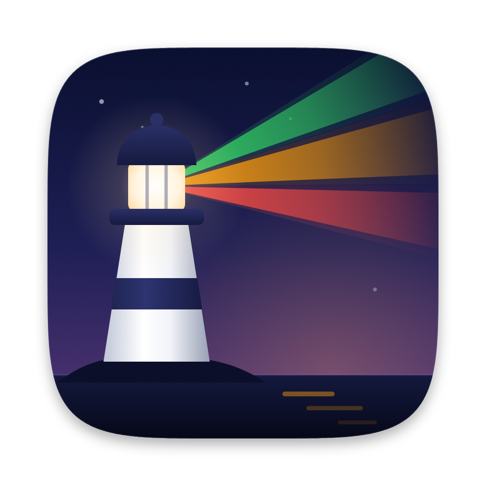
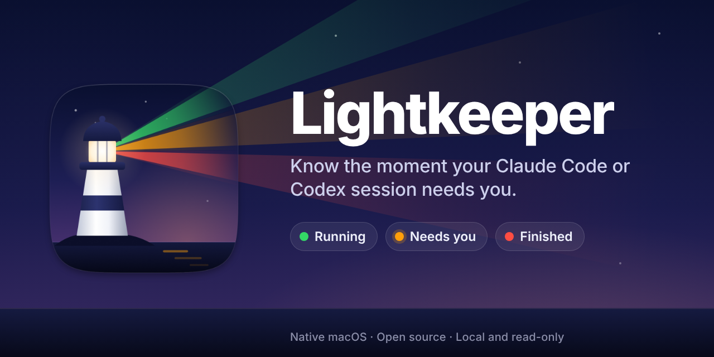
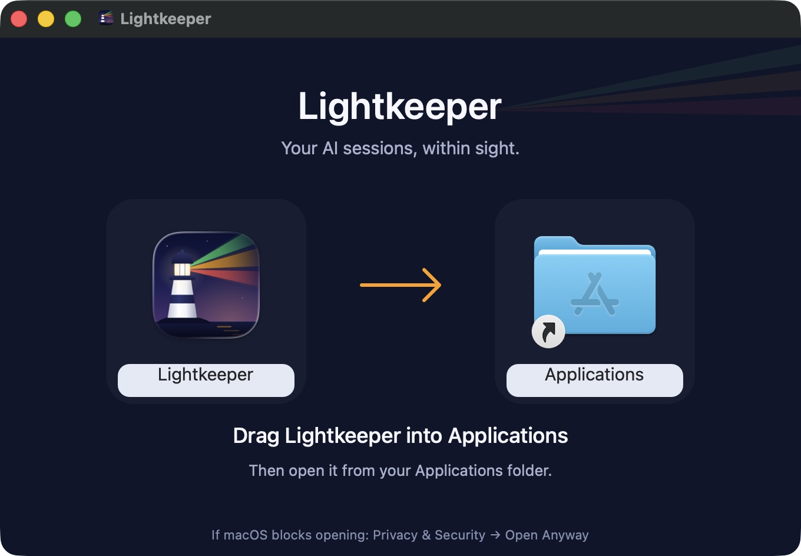

<p align="center">
  
</p>

<h1 align="center">Lightkeeper</h1>

<p align="center">
  <strong>Know the moment your Claude Code or Codex session needs you.</strong><br>
  A tiny native macOS window that keeps watch over your AI agents while you work somewhere else.
</p>

<p align="center">
  <a href="https://github.com/repeating/lightkeeper/releases/latest/download/Lightkeeper.dmg"></a>
  <a href="LICENSE"></a>
  
  
  
</p>

<p align="center">
  <a href="https://github.com/repeating/lightkeeper/releases/latest/download/Lightkeeper.dmg"><strong>Download Lightkeeper for macOS (.dmg)</strong></a> · <a href="https://github.com/repeating/lightkeeper/releases/latest">Release notes</a>
</p>

<p align="center">
  
</p>

---

You start an agent, switch to something else, and come back twenty minutes later to find it has been waiting for an approval the whole time. Or you keep alt-tabbing to check whether it's done yet.

**Lightkeeper ends both.** It's a small floating window that lists your live sessions and appears on its own whenever one of them changes state. It doesn't steal keyboard focus.

| | Status | Meaning |
|---|---|---|
| 🟢 | **Running** | The agent is working. Carry on. |
| 🟠 | **Needs you** | An approval, a question or another action is waiting for you. |
| 🔴 | **Finished** | The response is done, or the session ended. |
| ⚪ | **Unavailable** | Lightkeeper can't read the status. Gray never means "done". |

Click any row to jump straight into that conversation.

## Why Lightkeeper

- **Interrupts you only when it matters.** The window appears when a session starts or changes colour. The rest of the time it stays out of your way.
- **One click back into the conversation.** Claude desktop rows open the exact Code session. Codex rows open the matching chat. Terminal and IDE Claude sessions resume their transcript in Claude desktop.
- **Truly native.** SwiftUI and AppKit, no Electron. It floats above normal windows and follows you across Spaces.
- **Private by design.** It reads local status files and the Codex desktop's existing local socket. It makes no network requests, needs no account, and never saves conversation content.
- **Strictly read-only.** It never starts turns, approves actions, answers questions or changes your agent settings. It watches, and you decide.

## What it monitors

| Source | How | Permissions |
|---|---|---|
| **Claude Code**: desktop Code tab, Terminal and IDE sessions | Live session registry in `~/.claude/sessions` | None |
| **Codex desktop**: local threads | Read-only metadata query over the desktop's existing local IPC socket | None |
| **ChatGPT and Claude desktop chats** *(optional)* | Status controls exposed to macOS Accessibility. Message and draft text are never read. | Accessibility |

Not covered: browser tabs, and remote or cloud-only Codex sessions.

## Install

1. [Download Lightkeeper.dmg](https://github.com/repeating/lightkeeper/releases/latest/download/Lightkeeper.dmg).
2. Drag **Lightkeeper** into **Applications** and open it.
3. Start a Claude Code or Codex session. It appears in the window automatically.

<p align="center">
  
</p>

> **First launch:** release builds are ad-hoc signed and not yet notarized, so macOS may block the first launch. Open **System Settings → Privacy & Security** and choose **Open Anyway**. Apple explains this [here](https://support.apple.com/102445).

Requires macOS 14 or newer, on Apple Silicon or Intel.

## Using it

- **Hide** or the close button hides the window. Monitoring keeps running and the Dock icon stays.
- The next status change brings the window back. You can also click the Dock icon.
- **Clear finished** removes completed rows. A new response brings a dismissed session back.
- The **gear** button turns on optional ChatGPT and Claude desktop chat monitoring.
- **⌘Q** quits.

Optional desktop chat monitoring is off until you enable it. Setup shows **Accessibility access granted** once macOS authorizes the running copy. If Settings shows an enabled switch but the app still reports no access, use **Open Accessibility settings** and **Show this app**. Remove the stale entry, add the revealed app with **+**, enable its switch, then reopen Lightkeeper. The old entry may still be called Session Beacon. Local ad-hoc builds can require this again after updates.

Desktop monitoring reads exposed controls and sidebar rows. It filters old idle history; chats without a readable status become gray with “Status unavailable”. Clicking a selectable sidebar row opens that chat; hidden ChatGPT conversations without a selectable row may need to be reopened manually. Sidebar controls recreated by the app retain their identity when the title is unambiguous. Duplicate titles stay separate. Controls are currently recognized in English.

## Build from source

You need the Swift 6 Command Line Tools and Python 3 for DMG packaging. Full Xcode isn't required.

```sh
git clone https://github.com/repeating/lightkeeper.git
cd lightkeeper
scripts/test.sh            # core tests
scripts/test-monitors.sh   # monitor adapters
scripts/dmg.sh             # builds the universal app and DMG into dist/
```

The DMG script installs pinned packaging tools into `.build-tools/dmg`, verifies the mounted installer layout and app signature, and creates a branded drag-to-Applications window. These tools are not bundled in the app.

Building uses a project-local workaround for stale Swift package manifest interfaces; it does not change the Command Line Tools installation. The core test harness uses executable assertions because Command Line Tools do not include XCTest. Run `scripts/test-window.sh` for Hide/Dock/reopening/focus checks in an isolated demo.

Set `BEACON_SIGNING_IDENTITY` to an installed code-signing identity to sign releases with a certificate. The default is local ad-hoc signing, which does not preserve authorization across changed builds.

Handy flags:

```sh
dist/Lightkeeper.app/Contents/MacOS/Lightkeeper --demo       # simulated sessions; no real monitoring
dist/Lightkeeper.app/Contents/MacOS/Lightkeeper --diagnose   # 6-second live observation, then exit
```

## How it works

```
~/.claude/sessions/*.json ──► ClaudeMonitor ──┐
Codex desktop IPC (read-only) ──► CodexMonitor ─┼──► Session model ──► Floating window
Accessibility (opt-in) ──► DesktopChatMonitor ──┘
```

Codex subscribes to recent top-level local threads and reads runtime status and pending requests; previously finished history is omitted. Async question cards take priority over a running state, including while the agent continues working, and clear when an answer is accepted. Claude Code verifies session process liveness, reads explicit busy/waiting/idle states and excludes programmatic SDK/helper sessions. No hooks or agent settings are changed.

Conversation contents are not saved. Codex protocol snapshots can contain conversation data in memory; Lightkeeper does not write those snapshots to disk. Claude versions without the live session registry are not supported.

Each adapter maps its source onto the same four states. A source that disconnects or changes format is shown as **Unavailable**, never as finished.

> **Heads-up:** Claude Code and Codex store these files and socket messages in internal formats that can change with app updates. If an update breaks detection, include `--diagnose` output when reporting the issue. Review it for private session titles before sharing.

## Roadmap ideas

- [ ] Developer ID signing and notarization
- [ ] Optional sound or notification for **Needs you**
- [ ] Menu-bar mode
- [ ] More agents (Cursor, Gemini CLI, Aider…). Adapters are small; PRs welcome.

## Contributing

Contributions are welcome, especially new agent adapters and fixes after upstream format changes. See [CONTRIBUTING.md](CONTRIBUTING.md). Report problems through [GitHub Issues](https://github.com/repeating/lightkeeper/issues).

## License

MIT © 2026 Fadi Younes. See [LICENSE](LICENSE).

<sub>Lightkeeper is an independent project and is not affiliated with Anthropic or OpenAI. Claude and Claude Code are trademarks of Anthropic. Codex and ChatGPT are trademarks of OpenAI.</sub>
